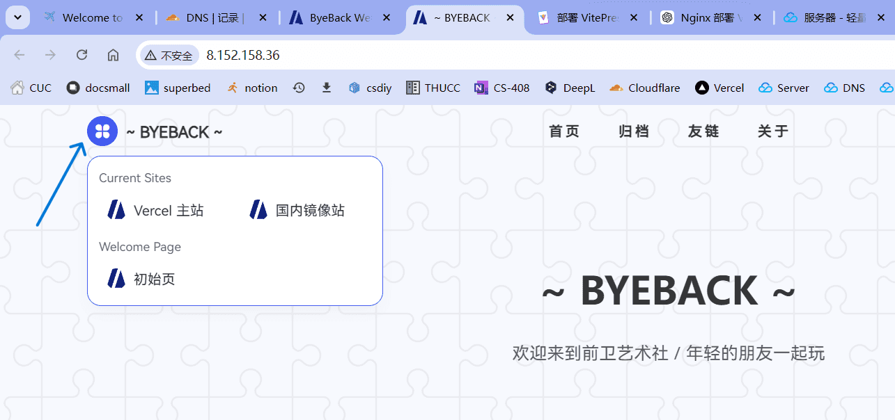

## 关于投稿

- 本站是基于 VitePress 搭建的静态网页, 可以将它看作一个公告板或电子手帐, 用于记录和展示社团活动, 提供和谐、自由的信息分享环境. 

- 大家可以将自己创作的文章发送至邮箱 byebacker@163.com . 内容和题材不限, 可以是技术分享、关于音乐、诗歌、书籍、软件的感想和推荐、发起新活动、薅羊毛项目、户外与旅游记录、散文随笔、生活记录、个人介绍、各种吐槽 ... 形式自由 !

- 建议大家在邮件里带上自己的昵称 ( 昵称作为文章的一个标签, 如果想要匿名那就是 anonyms 标签 )

- 如果发现网页的任何问题或想提出建议, 也请反馈到邮箱, 谢谢 ~

 

## 投稿格式

- 我们的网页是基于 markdown 进行渲染的, 不熟悉 markdown 也没关系, 它本质上只是一个简单的笔记规则 ( 比如 Obsidian 就是基于 markdown ) . 我们可以学习简单的语法, 比如 [8 分钟让你快速掌握 Markdown](https://www.bilibili.com/video/BV1JA411h7Gw) . markdown 编辑器有 Typora, Obsidian, VS Code, Atom 等, 也可以用最简单的在线编辑器:  https://markdown.com.cn/editor/. 以及在 [语雀](https://www.yuque.com/dashboard) 和 [Notion](https://www.notion.so/) 上的笔记都可以自由导出为 markdown

- VitePress 上也存在一些定制的 markdown 语法, 能在网页上生成特殊组件, 可阅读 [Curve 主题文档 - 标签使用](https://blog.imsyy.top/posts/2024/0307)

- 如果你熟悉 **github**, 还可以直接修改项目仓库 https://github.com/Dalecuc/byeback 并提交 PR , 也可以加入 Collaborators 小组中

- 当然, 如果实在不想用 markdown 写作, 直接将文字或 pdf , docx, txt 发送到邮箱里也是可以的, 我们收到后会手动将其转化为 md 发布,  ( 只要文本不是非常复杂 )

 

## 如何访问

- 我们在 Vercel 上托管了网页, 网址为 : https://icu.byeback.icu 其服务器在国外, 由于防火长城的存在, 在墙内访问起来偶尔不太顺畅, 如果你了解 **科学上网** ( 即翻墙, 不熟悉可以联系李多扬, 群昵称 L, 微信 lihan2049 ), 那就可以优先选择 **icu.byeback.icu** 了

- 为了便于国内访问, 我们搭建了镜像站点, 链接为最简单的 IP 地址 :  http://8.152.158.36/ ( 国内服务器部署的网站需要工信部审核后才能绑定域名, 所以还没给此服务器分配域名 ). 

- 国内镜像站的网址随时可能更换, 你只需记忆最简单的网址 **byeback.icu** 即可 ~

- 从 **byeback.icu** 点击进入网页, 默认为国内镜像站, 你可以通过网页左上角 `~ BYEBACK ~` 左边的四叶草状小按钮来切换站点, 如下图 : 

 

## 网页设置

- 网页左下角有一个悬浮的小按钮, 可以点击进行个性化配置, 如字体大小、格式、网站背景等 

- 网页右上角有几个小按钮, 你也可以点击探索下它们的功能 ~

 

## 开发维护

- 参与网页开发的成员有 **`Lemonlesbian` 、`Dale` 、 `L ( 21 网安 ldy )`**. 开发者需要更新网页内容, 维护正常运行, 并尝试开发新的功能. 

- 如果你有 Linux、git、markdown 等方面的基础或有过建站经验,  请加入我们 !  当然, 如果你有热情, 其实从零掌握这些技能也只需要几个小时 ~  

- 对网站有任何建议也请通过邮箱 byebacker@163.com 反馈 ~

 
 

::: tip Author
Dale, 2024 / 10 / 22
:::

 
 

